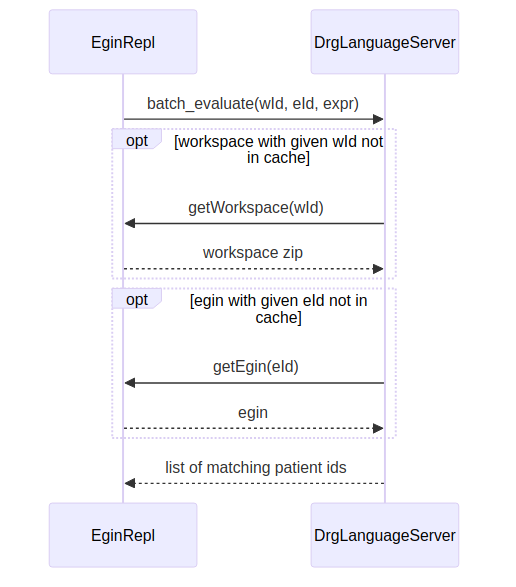

# Table of Contents

1.  [Sequenzdiagramm](#org76cbc78)
2.  [API EginRepl](#org507ef1f)
    1.  [Egin-Anfrage](#orgb332d7c)
    2.  [Workspace-Anfrage](#orgbeaedee)
3.  [API DrgLanguageServer](#orgdd11d5f)
    1.  [Evaluate an Egin](#orgdbb72bf)

# Sequenzdiagramm

# API EginRepl

## Egin-Anfrage

    GET /api/admin/egins/{id}/egin.csv

Params:

-   id [String], required

Beispiel

    curl -X GET "http://localhost:3001/api/admin/egins/eadf029e-311f-4bd8-879e-28c058bd250e/egin.csv" -H  "accept: application/json" -H  "Authorization: 3ec386a8982df2f54f7569646bedf4e80a4ac32034b1d6192b40100c49662c52"

Anmerkung:
  die EginRepls kann den mitgeschickte Authorization-Header ignorieren

Response:

-   Content type: text/csv
-   Code: 200
-   Headers:
    
    > cache-control: max-age=0, private, must-revalidate 
    > content-type: text/csv
-   Body:
    
    > 1;52779249;20240122;20240123;2;01;00;19530000;;70;0;W;0;K116:;;;;1 &#x2026;
    > &#x2026;

## Workspace-Anfrage

    GET /api/workspaces/{id}/export?export_format=specs_v2&silent=true

Params:

-   exportformat (specsv2|backup), optional
-   silent [boolean], optional

Anmerkung:
  Der DLS sendet diese beiden Parameter:

1.  exportformat=specsv2
2.  silent=true

Die EginRepls muss sie aber nicht beachten, sondern schickt so oder so die von uns zur Verfuegung gestellten Workspace-Zips zurueck.

Beispiel:

    curl -X GET "http://localhost:3000/api/workspaces/3d6999a2-f381-4269-92d3-f3fb1b57fadf/export?export_format=specs_v2&silent=true" -H  "accept: application/json" -H  "Authorization: anystring"

Response:

-   Content type: application/zip
-   Code: 200 Export zipped workspace
-   Headers:
    
    > cache-control: max-age=0, private, must-revalidate 
    > content-type: application/zip

# API DrgLanguageServer

## Evaluate an Egin

    GET /batch_evaluate?workspace_id={workspace_id}&update_at=

Params:

-   workspaceid [String], required
-   eginid [String], required
-   expression [String], required; logical expression used to find matching patients in the given egin using the given workspace
-   timestamp [String], required; last modified time of the given Workspace.
    Note: Can be any string as long as it doesn&rsquo;t change between subsequent batchevaluate requests, since this string is used as key for the Workspace cache.

Example:

    curl -v -H "Authorization: anystring" http://localhost:8787/batch_evaluate?workspace_id=3d6999a2-f381-4269-92d3-f3fb1b57fadf&workspace_updated_at=0&egin_id=eadf029e-311f-4bd8-879e-28c058bd250e&expression=SRG%20IN%20TABLE%28%20GFA2120NO%20%29

Response:

-   Content type: application/json
-   Code: 200
-   Headers:
-   Body:
    
    [&ldquo;12345&rdquo;, &ldquo;2929393&rdquo;, &ldquo;9239230&rdquo;, &#x2026;] 
    
    []

Example Response (that found matching patients):

    TP/1.1
    > Host: localhost:8787
    > User-Agent: curl/8.5.0
    > Accept: */*
    > Authorization: ae6a42466c8ab98551e7403eeebda991b3269e12da4ed86df4cb2c15a1e6820a
    >
    < HTTP/1.1 200 OK
    < Date: Wed, 18 Mar 2026 09:50:00 GMT
    < Access-Control-Allow-Methods: GET,POST,OPTIONS
    < Access-Control-Allow-Origin: *
    < Content-Type: application/json
    < Transfer-Encoding: chunked
    < Server: Jetty(9.4.48.v20220622)
    <
    ["55176360","55176838","55176882",...]

